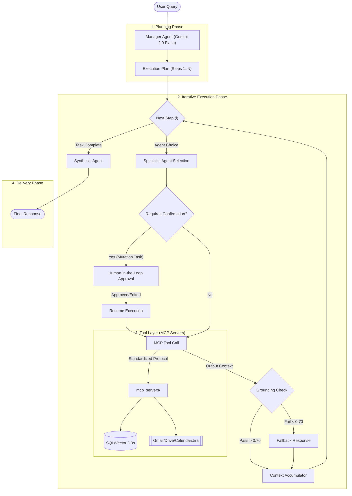

# 🤖 Vertical AI Agent

[](https://www.python.org/)
[](https://fastapi.tiangolo.com/)
[](https://logfire.pydantic.dev/docs/pydantic-ai/)
[](https://modelcontextprotocol.io/)
[](https://ai.google.dev/)
[](LICENSE)

**A production-grade Multi-Agent Orchestration System built with Pydantic AI and Model Context Protocol (MCP) for enterprise workspace automation.**

Broad-scoped AI systems often struggle with specialized tasks. **Vertical AI Agent** solves this by using a **Manager-Specialist architecture** — a central Manager Agent powered by Google Gemini decomposes complex user requests into discrete, executable steps performed by domain-specific specialist agents, each with direct access to corporate tools and data via the Model Context Protocol.

> [!IMPORTANT]
> This system is designed for enterprise-grade automation. It handles planning, execution, and synthesis across disparate data silos (SQL databases, Google Drive, Gmail, Calendar, Jira, meeting transcripts) in a single unified flow — with human-in-the-loop safety for all mutation operations.

---

## Table of Contents

- [Architecture Overview](#-architecture-overview)
- [Key Features](#-key-features)
- [Use Cases](#-common-application-use-cases)
- [Technical Stack](#-technical-stack)
- [Project Structure](#-project-structure)
- [Module Deep-Dive](#-module-deep-dive)
  - [Backend Core](#backend-core)
  - [MCP Servers](#mcp-servers-tool-layer)
  - [Frontend](#frontend)
  - [Evaluation Pipeline](#evaluation-pipeline)
- [API Reference](#-api-reference)
- [Data Model & Execution Plan](#-data-model--execution-plan)
- [Security & Authentication](#-security--authentication)
- [Getting Started](#-getting-started)
- [Environment Variables](#-environment-variables)
- [Evaluation & Testing](#-evaluation--testing)
- [Contributing](#-contributing)
- [License](#-license)

---

## 🏗️ Architecture Overview

The system follows a triple-stage execution model: **Planning** → **Execution** → **Synthesis**.



### How It Works

1. **User submits a query** through the chat UI or API.
2. **Manager Agent** analyzes the query, considers temporal context (current date/time), conversation history, and generates a structured `ExecutionPlan` with one or more steps.
3. **PlanExecutor** iterates over each step:
   - Resolves input dependencies from previous steps (via `{{steps.s1.output}}` templating).
   - Routes the step to the correct specialist agent.
   - If the step is flagged `requires_confirmation`, pauses for human approval before executing.
   - The specialist agent invokes MCP tools to interact with external services.
4. **General Agent** synthesizes all step outputs into a polished final response.
5. **Response is streamed** back to the frontend via Server-Sent Events (SSE).

---

## 🌟 Key Features

### 1. Intelligent Orchestration (The Manager)
The **Manager Agent** (powered by Gemini 2.0 Flash) acts as the system's brain. It analyzes user intent, considers temporal context, and generates a structured `ExecutionPlan`.

- **Intent Rewriting**: Converts vague queries into precise, actionable step instructions.
- **Dependency Resolution**: Steps can depend on outputs from previous steps (e.g., "Use the email address found in Step 1").
- **Input Templating**: `{{steps.s1.output}}` syntax passes data dynamically between agents.
- **Clarification Loop**: If a request is ambiguous, the manager pauses and asks clarifying questions before proceeding.
- **Error Policy**: Configurable per-plan error handling — `retry`, `ask_user`, `fail_fast`, or `skip`.

### 2. Specialized Agent Fleet
Each agent is a domain expert with purpose-built tools via MCP:

| Agent | Tools | Description |
|-------|-------|-------------|
| 📧 **Email** | `list_messages`, `get_message`, `send_email`, `mark_read/unread`, `trash_message`, `list_labels`, `add/remove_label` | Full Gmail management with label-based organization |
| 🗄️ **SQL** | `test_connection`, `list_databases`, `list_tables`, `get_schema`, `sample_rows`, `execute_query` | Safe MySQL query generation and execution against Salesforce data |
| 📄 **Drive** | `list_files`, `search_files`, `get_file_content`, `create_folder`, `upload_file`, `download_file`, `get_file_metadata` | Google Drive file management with Office document content extraction |
| 📅 **Calendar** | `list_upcoming_events`, `create_event`, `create_meet_conference` | Google Calendar scheduling and Google Meet creation |
| 🎙️ **TLDV** | `search_meetings`, `search_documents` | Semantic search across meeting transcripts and documents via RAG pipeline |
| 🐞 **Jira** | `search_issues`, `get_issue`, `create_issue`, `update_issue`, `add_comment`, `transition_issue`, `list_projects`, `get_my_issues` | Full Jira project management (supports Cloud + Data Center) |
| 💬 **General** | *(none — LLM only)* | Response synthesis and general knowledge questions |

### 3. 🛡️ Human-in-the-Loop Safety
-   **High-Risk Action Detection**: Steps involving data mutation (sending emails, updating databases, creating Jira tickets) are automatically flagged via `requires_confirmation`.
-   **User Approval UI**: The system pauses execution and renders a confirmation dialog in the frontend.
-   **Modifiability**: Users can edit the agent's proposed action (e.g., rewriting an email draft) before approving it.
-   **Cancel Capability**: Users can cancel any flagged step, providing full control over automated actions.

### 4. Transparent Streaming Execution
-   **Server-Sent Events (SSE)**: Real-time feedback on agent progress (step starts, SQL queries generated, status updates).
-   **Step Cards**: Each agent step is rendered as a visual card in the UI showing the agent type and instruction.
-   **Deterministic Data Passing**: Explicit inter-step data passing prevents "hallucinated actions."

---

## 💼 Common Application Use Cases

### 🏢 Enterprise CRM Automation
> *"Find all high-value leads from last month and draft a follow-up email."*
1. **SQL Agent** → Queries Salesforce DB for leads with `Amount > $10k` created in the last 30 days.
2. **Manager** → Formats the list of leads into a structured summary.
3. **Email Agent** → Drafts a personalized outreach email for each lead *(pauses for user review)*.

### 📅 Intelligent Scheduling
> *"Schedule a sync with the engineering team to discuss the Q3 roadmap based on the last meeting's notes."*
1. **TLDV Agent** → Searches past meeting transcripts for "Q3 roadmap" action items.
2. **Calendar Agent** → Checks availability for participants mentioned in the notes.
3. **Calendar Agent** → Creates a Google Meet event with the agenda derived from the transcript.

### 🐞 Automated Bug Triage
> *"Check the latest error logs in Drive and create Jira tickets for critical issues."*
1. **Drive Agent** → Reads the latest log file from the "Server Logs" folder.
2. **Manager** → Parses logs to identify `CRITICAL` error patterns.
3. **Jira Agent** → Creates bug tickets in the `ENG` project with log snippets attached.

### 📊 Cross-Platform Reporting
> *"Summarize last week's sales numbers and email the report to the leadership team."*
1. **SQL Agent** → Queries weekly sales aggregates from the Opportunities table.
2. **General Agent** → Synthesizes findings into a formatted executive summary.
3. **Email Agent** → Drafts and sends the report *(pauses for review)*.

---

## 🛠️ Technical Stack

| Layer | Technology | Purpose |
|-------|-----------|---------|
| **Agent Framework** | [Pydantic AI](https://logfire.pydantic.dev/docs/pydantic-ai/) | Type-safe, structured agent interactions with Pydantic models |
| **Tool Protocol** | [Model Context Protocol (MCP)](https://modelcontextprotocol.io/) via [FastMCP](https://github.com/jlowin/fastmcp) | Standardized tool communication between agents and services |
| **LLM** | Google Gemini 2.0 Flash | Planning, execution, synthesis, and embedding generation |
| **Backend** | [FastAPI](https://fastapi.tiangolo.com/) + Uvicorn | REST API with SSE streaming, async request handling |
| **Vector Database** | [Pinecone](https://www.pinecone.io/) | Meeting transcript and document vector storage and retrieval |
| **Reranking** | [Cohere](https://cohere.com/) Rerank API | Context reranking for improved RAG precision |
| **Relational Database** | MySQL via [PyMySQL](https://pymysql.readthedocs.io/) | Salesforce CRM data storage and querying |
| **Google Workspace** | Gmail API, Drive API, Calendar API | Email, file management, and scheduling |
| **Project Management** | [Jira REST API](https://developer.atlassian.com/cloud/jira/platform/rest/) | Issue tracking, project management |
| **Observability** | [Langfuse](https://langfuse.com/) | LLM tracing, latency monitoring, cost tracking |
| **Frontend** | Vanilla HTML/JS + [Tailwind CSS](https://tailwindcss.com/) | Glassmorphic chat interface with real-time streaming |
| **Embeddings** | `google-genai` (`text-embedding-004`) | Vector embeddings for RAG search |

---

## 📂 Project Structure

```
vertical_aiAgent/
├── main.py                     # FastAPI app, API endpoints, SSE streaming, auth
├── agents.py                   # Agent definitions, system prompts, Pydantic models
├── executor.py                 # PlanExecutor — multi-step execution engine
├── utils.py                    # Temporal context, schema formatting, result helpers
├── auth_google.py              # Google OAuth 2.0 token generation
├── sql_context.md              # SQL schema documentation and query patterns
│
├── mcp_servers/                # MCP Tool Servers (one per integration)
│   ├── sql_server.py           # MySQL database operations
│   ├── email_server.py         # Gmail API operations
│   ├── calendar_server.py      # Google Calendar + Meet
│   ├── drive_server.py         # Google Drive file management
│   ├── rag_server.py           # RAG pipeline (Pinecone + Cohere reranker)
│   └── jira_server.py          # Jira Cloud/Data Center operations
│
├── evaluation/                 # RAG evaluation pipeline (RAGAS)
│   ├── generate_testset.py     # Synthetic Q&A test set generation
│   ├── evaluate_rag.py         # RAGAS metric evaluation runner
│   ├── verify_pipeline.py      # Single-sample pipeline verification
│   ├── testset.json            # Generated test cases
│   └── rag_evaluation_report.csv  # Evaluation results
│
├── tests/                      # Test and debug scripts
│   ├── test_drive.py           # Drive integration tests
│   ├── test_rag_*.py           # RAG pipeline tests
│   ├── test_jira_selection.py  # Jira agent selection tests
│   ├── test_manager_structure.py  # Manager plan structure tests
│   ├── verify_*.py             # Migration and integration verification
│   └── inspect_*.py            # Debugging inspection scripts
│
├── index.html                  # Frontend chat interface
├── script.js                   # Frontend logic (ChatApp class)
├── requirements.txt            # Python dependencies
├── .gitignore                  # Git ignore rules
└── .env                        # Environment variables (not committed)
```

---

## 🔬 Module Deep-Dive

### Backend Core

#### `main.py` — FastAPI Application
The application entry point. Manages the full request lifecycle:

- **Lifespan Context Manager**: Initializes all agents and MCP servers at startup via `initialize_agents()`, and gracefully shuts down MCP server connections on exit.
- **Authentication**: HTTP Basic Auth middleware (`check_auth`) validates credentials against `AGENT_USERNAME` / `AGENT_PASSWORD` environment variables (defaults: `admin` / `admin`).
- **CORS**: Configured for `localhost` development (`ports 3000, 5500, 8080`) and `127.0.0.1`.
- **Conversation History**: Maintains a global `conversation_history` list with a sliding window of the last 10 turns (`keep_last_n_turns`).
- **Endpoints**: See [API Reference](#-api-reference).

#### `agents.py` — Agent Definitions
Defines all 7 agents and the data models that drive orchestration:

- **`AgentSelection`** (Enum): `EMAIL`, `SQL`, `DRIVE`, `CALENDAR`, `TLDV`, `JIRA`, `GENERAL`.
- **`Step`** (Pydantic Model): Defines a single execution step with `id`, `agent`, `instruction`, `inputs` (dict), `depends_on` (list of step IDs), and `requires_confirmation` (bool).
- **`ExecutionPlan`** (Pydantic Model): Defines the full plan with `steps`, `rewritten_intent`, `final_response_instruction`, `error_policy`, and `clarifying_questions`.
- **Manager Agent**: The planning agent uses Gemini 2.0 Flash with a detailed system prompt that understands temporal context, available agents, and produces structured `ExecutionPlan` output.
- **Specialist Agents**: Each agent is initialized with its own system prompt and connected to the corresponding MCP server via `MCPServerStdio`.
- **`initialize_agents()`**: Loads SQL schema from the database at startup and injects it into the SQL agent's system prompt. Also registers MCP tools with each agent.

#### `executor.py` — PlanExecutor
The execution engine that processes `ExecutionPlan` step by step:

- **Input Resolution**: Resolves `{{steps.s1.output}}` placeholders by substituting outputs from completed steps.
- **Step Execution**: Routes each step to the correct specialist agent, passing resolved instructions and context.
- **Confirmation Flow**: Pauses execution when `requires_confirmation` is set, yields a `confirmation_request` event, and resumes from the confirmed step index.
- **SQL Data Extraction**: Captures SQL query results and structures them as `sql_data` (with `rows`, `columns`, `executed_query`, `executed_explanation`) for rich frontend rendering.
- **Response Synthesis**: After all steps complete, invokes the General Agent with accumulated context and the plan's `final_response_instruction` to produce the final answer.
- **Event Streaming**: Yields structured events (`status`, `step_start`, `sql_query`, `confirmation_request`, `result`, `error`) for SSE consumption.

#### `utils.py` — Utility Functions
- **`get_temporal_context()`**: Returns formatted current date/time string injected into agent prompts.
- **`format_schema_rows(rows)`**: Converts raw SQL schema rows into a structured text description for the SQL agent's system prompt.
- **`format_sql_results(rows, columns)`**: Formats SQL query results into a human-readable table with aligned columns and row counts.

#### `auth_google.py` — Google OAuth Setup
One-time OAuth 2.0 flow for Google Workspace APIs:
- Requests scopes for Gmail (read, send, modify), Calendar (read, events), and Drive (read).
- Uses `InstalledAppFlow` with the local server strategy.
- Saves credentials to `token.json` for subsequent use by MCP servers.

---

### MCP Servers (Tool Layer)

Each MCP server is a standalone [FastMCP](https://github.com/jlowin/fastmcp) process that exposes tools callable by the agents.

#### `sql_server.py` — MySQL Operations
| Tool | Parameters | Description |
|------|-----------|-------------|
| `test_connection` | — | Verifies MySQL connectivity |
| `list_databases` | — | Lists all available databases |
| `list_tables` | `database` | Lists tables in a database |
| `get_schema` | `database`, `table` | Returns column names, types, keys |
| `sample_rows` | `database`, `table`, `limit` | Returns sample data rows |
| `execute_query` | `query` | Executes a SQL query and returns results (max 50 rows) |

**Safety**: Uses read-only connections by default. Query timeouts and row limits are enforced.

#### `email_server.py` — Gmail Operations
| Tool | Parameters | Description |
|------|-----------|-------------|
| `list_messages` | `max_results`, `label`, `query` | Lists Gmail messages with optional filtering |
| `get_message` | `message_id` | Retrieves full email content (subject, from, to, body) |
| `send_email` | `to`, `subject`, `body`, `cc`, `bcc` | Sends an email via Gmail API |
| `mark_as_read` / `mark_as_unread` | `message_id` | Toggles read status |
| `trash_message` | `message_id` | Moves message to trash |
| `list_labels` | — | Lists all Gmail labels |
| `add_label` / `remove_label` | `message_id`, `label_name` | Label management |

**Auth**: Uses `token.json` (generated by `auth_google.py`) for OAuth credentials.

#### `calendar_server.py` — Google Calendar
| Tool | Parameters | Description |
|------|-----------|-------------|
| `list_upcoming_events` | `max_results`, `time_min` | Lists upcoming calendar events |
| `create_event` | `summary`, `start`, `end`, `description`, `attendees` | Creates a calendar event |
| `create_meet_conference` | `summary`, `start`, `end`, `attendees` | Creates a Google Meet video conference event |

#### `drive_server.py` — Google Drive
| Tool | Parameters | Description |
|------|-----------|-------------|
| `list_files` | `max_results`, `folder_id` | Lists files and folders |
| `search_files` | `query`, `max_results` | Searches Drive with query string |
| `get_file_content` | `file_id` | Gets file content with Office format extraction (.docx, .xlsx, .pptx) |
| `create_folder` | `name`, `parent_id` | Creates a new folder |
| `get_file_metadata` | `file_id` | Returns file metadata (name, size, dates, permissions) |
| `upload_file` | `name`, `content`, `mime_type`, `parent_id` | Uploads a file to Drive |
| `download_file` | `file_id`, `path` | Downloads a file locally |

**Content Extraction**: Supports reading content from Google Docs, Sheets, `.docx`, `.xlsx`, `.pptx`, and `.csv` files using XML parsing for Office formats.

#### `rag_server.py` — RAG Pipeline (Meeting/Document Search)
| Tool | Parameters | Description |
|------|-----------|-------------|
| `search_meetings` | `query`, `limit`, `min_similarity`, `speaker_filter`, `date_from`, `date_to` | Semantic search across meeting transcripts |
| `search_documents` | `query`, `limit`, `min_similarity`, `doc_type_filter` | Semantic search across documents |

**Pipeline Architecture**:
1. **Query Embedding**: Uses `google-genai` (`text-embedding-004`) to embed the search query.
2. **Vector Search**: Queries Pinecone index with optional metadata filters (speaker, date range, document type).
3. **Reranking**: Uses Cohere Rerank API (`rerank-v3.5`) to reorder results by relevance to the original query.
4. **Result Formatting**: Returns ranked results with content, metadata (meeting ID, speaker, timestamp), and similarity scores.

#### `jira_server.py` — Jira Project Management
| Tool | Parameters | Description |
|------|-----------|-------------|
| `search_issues` | `jql`, `max_results`, `fields` | Searches issues using JQL |
| `get_issue` | `issue_key` | Gets full issue details |
| `create_issue` | `project_key`, `summary`, `description`, `issue_type`, `priority`, `assignee`, `labels` | Creates a new issue |
| `update_issue` | `issue_key`, `fields` | Updates issue fields |
| `add_comment` | `issue_key`, `body` | Adds a comment to an issue |
| `get_comments` | `issue_key` | Retrieves all comments |
| `transition_issue` | `issue_key`, `transition_id` | Transitions issue status |
| `list_transitions` | `issue_key` | Lists available transitions |
| `list_projects` | — | Lists all accessible projects |
| `get_my_issues` | `max_results` | Gets issues assigned to current user |

**Auth**: Supports both Personal Access Token (PAT) for Data Center and Basic Auth (email + API token) for Jira Cloud.

---

### Frontend

#### `index.html` + `script.js` — Chat Interface
A single-page chat application with a nature-themed glassmorphic design:

- **Design System**: Custom Tailwind CSS configuration with a nature-inspired color palette (`nature-dark`, `nature-medium`, `nature-light`, `nature-accent`) and glassmorphism effects (`glass-base`, `glass-card`, `glass-input`).
- **Typography**: [Manrope](https://fonts.google.com/specimen/Manrope) font family with [Material Symbols Outlined](https://fonts.google.com/icons) icons.
- **ChatApp Class** (`script.js`): Manages the entire client-side lifecycle:
  - **Authentication**: Login overlay with Basic Auth → `localStorage` persistence.
  - **Streaming**: SSE-based message reading via `readStream()` — handles `status`, `step_start`, `sql_query`, `confirmation_request`, `result`, and `error` event types.
  - **Markdown Rendering**: Custom `formatMessage()` and `parseInline()` methods for headers, lists, code blocks, bold, italic, and links.
  - **SQL Table Rendering**: `createSQLTable()` builds responsive HTML tables for query results.
  - **Confirmation UI**: `renderConfirmationUI()` renders an editable approval dialog for flagged steps, with confirm/cancel actions.
  - **Auto-resizing Textarea**: Dynamic height adjustment for the input field.
  - **Suggestion Chips**: Pre-built query shortcuts (draft email, query DB, schedule meeting, search Drive, summarize meeting).
- **Sidebar**: Collapsible navigation showing connected services (Gmail, TLDV, Calendar, Google Meet, Database), new chat button, logout, and connection status indicator.
- **Responsive**: Mobile-optimized with a hamburger menu toggle for the sidebar.

---

### Evaluation Pipeline

Located in `evaluation/`, this pipeline benchmarks the RAG agent's performance using the [RAGAS](https://docs.ragas.io/) framework.

#### `generate_testset.py` — Test Set Generation
1. **Context Fetching**: Queries the RAG server with diverse seed queries ("marketing", "engineering", "sales", etc.) to collect context chunks from Pinecone.
2. **Q&A Generation**: Uses Gemini 2.0 Flash to generate question-answer pairs from each retrieved context chunk.
3. **Output**: Saves a `testset.json` file with questions, ground truth answers, and source contexts.

#### `evaluate_rag.py` — RAGAS Evaluation
1. **Agent Execution**: Runs the TLDV agent on each test question and captures both the answer and the retrieved contexts (extracted from `ToolReturnPart` messages).
2. **Metrics**: Evaluates using four RAGAS metrics:
   - **Faithfulness**: Is the answer grounded in the retrieved context?
   - **Answer Relevancy**: Does the answer address the question?
   - **Context Precision**: Are the retrieved chunks relevant?
   - **Context Recall**: Did retrieval capture the needed information?
3. **Judge LLM**: Uses Gemini 2.0 Flash as the evaluation judge with `all-MiniLM-L6-v2` embeddings from HuggingFace.
4. **Output**: Saves a detailed `rag_evaluation_report.csv`.

#### `verify_pipeline.py` — Quick Verification
A single-sample smoke test that runs one question from the test set through the TLDV agent and validates that a non-empty answer is returned.

---

## 📡 API Reference

All endpoints require HTTP Basic Authentication via the `Authorization` header.

| Method | Endpoint | Description |
|--------|----------|-------------|
| `GET` | `/health` | Health check — returns agent and MCP server status |
| `GET` | `/verify-auth` | Validates authentication credentials |
| `POST` | `/query` | Synchronous query processing (full response) |
| `GET` | `/query-stream?query=...` | **Primary endpoint** — SSE streaming query with real-time step updates |
| `POST` | `/confirm-step` | Resumes paused execution after human approval |
| `POST` | `/reset-history` | Clears conversation history |
| `GET` | `/schema` | Returns the loaded SQL database schema |

### SSE Event Types (from `/query-stream`)

| Event Type | Payload | Description |
|------------|---------|-------------|
| `status` | `{content: string}` | General status update |
| `step_start` | `{step_id, agent, instruction}` | A new step is beginning execution |
| `rewritten_query` | `{content: string}` | The manager's rewritten user intent |
| `sql_query` | `{query, explanation}` | A SQL query was generated |
| `confirmation_request` | `{step_id, step_index, instruction, inputs, session_id}` | Execution paused for user approval |
| `result` | `{success, response, intent, sql_data, error}` | Final result of the query |
| `error` | `{error: string}` | An error occurred during processing |

---

## 📋 Data Model & Execution Plan

### ExecutionPlan (Output of Manager Agent)

```python
class ExecutionPlan(BaseModel):
    steps: list[Step]                          # Ordered steps to execute
    rewritten_intent: str                      # Refined summary of user request
    final_response_instruction: str            # How to synthesize the final response
    error_policy: Literal["retry", "ask_user", "fail_fast", "skip"]
    clarifying_questions: list[str]            # Questions if request is ambiguous
```

### Step (Individual Execution Unit)

```python
class Step(BaseModel):
    id: str                                    # Unique step ID (e.g., "s1")
    agent: AgentSelection                      # Which agent to use
    instruction: str                           # What the agent should do
    inputs: dict[str, str]                     # Named inputs (can use templates)
    depends_on: list[str]                      # Step IDs this step depends on
    requires_confirmation: bool                # If True, pause for user approval
```

### SQL Schema Context
The system operates against a Salesforce-exported MySQL database. The full schema is documented in `sql_context.md` and includes 17 tables:

`Account`, `Contact`, `Opportunity`, `Session`, `ProgramInstructorAvailability`, `Deliverable`, `Lead`, `Campaign`, `CampaignMember`, `Student`, `SessionAttendance`, `AccountContactRelation`, `AccountHistory`, `ContactHistory`, `LeadHistory`, `OpportunityHistory`, `OpportunityPipelineHistory`, `CommunicationLogEntry`, `DataDictionaryFields`

The SQL agent's system prompt is dynamically enriched with the actual schema at startup (via `initialize_agents()`).

---

## 🔒 Security & Authentication

| Layer | Mechanism | Details |
|-------|-----------|---------|
| **API Access** | HTTP Basic Auth | Username/password validated against env vars; returned as `401` on failure |
| **Frontend** | `localStorage` token | Base64-encoded credentials stored client-side |
| **Google Workspace** | OAuth 2.0 | Scopes: `gmail.readonly`, `gmail.send`, `gmail.modify`, `calendar`, `drive.readonly`. Token saved to `token.json` |
| **Jira** | PAT / Basic Auth | Personal Access Token for Data Center; email + API token for Cloud |
| **Database** | Environment variables | MySQL credentials via `.env` (never committed to Git) |
| **Secrets** | `.env` file | All API keys and credentials stored in `.env`, excluded via `.gitignore` |

---

## 🚀 Getting Started

### Prerequisites
- Python 3.10+
- MySQL Server (with Salesforce-exported data)
- [Pinecone](https://www.pinecone.io/) account and index
- [Google Cloud Project](https://console.cloud.google.com/) with Gmail, Calendar, and Drive APIs enabled
- [Gemini API Key](https://ai.google.dev/)
- (Optional) [Jira](https://www.atlassian.com/software/jira) instance with API access
- (Optional) [Cohere](https://cohere.com/) API key for reranking
- (Optional) [Langfuse](https://langfuse.com/) account for observability

### Installation

1. **Clone the repository**:
   ```bash
   git clone https://github.com/chetanreddyv/vertical_aiAgent.git
   cd vertical_aiAgent
   ```

2. **Set up virtual environment**:
   ```bash
   python3 -m venv .venv
   source .venv/bin/activate
   pip install -r requirements.txt
   ```

3. **Configure environment** — create a `.env` file (see [Environment Variables](#-environment-variables)).

4. **Set up Google OAuth**:
   ```bash
   # Place your OAuth client_secret.json in the project root
   python auth_google.py
   # Follow the browser flow to authorize — generates token.json
   ```

5. **Run the application**:
   ```bash
   uvicorn main:app --host 0.0.0.0 --port 8001
   ```

6. **Open the frontend**: Navigate to `index.html` in your browser (or serve via Live Server on port 5500).

> [!NOTE]
> MCP servers are automatically started and managed by the agent framework at application startup. No separate server processes are needed.

---

## 🔑 Environment Variables

Create a `.env` file in the project root with the following:

```env
# --- Core ---
GEMINI_API_KEY=your_gemini_api_key

# --- Authentication (for API access) ---
AGENT_USERNAME=admin           # Default: admin
AGENT_PASSWORD=admin           # Default: admin

# --- MySQL Database ---
DB_HOST=localhost
DB_USER=root
DB_PASSWORD=your_mysql_password

# --- Google OAuth ---
GOOGLE_OAUTH_CLIENT_ID=your_oauth_client_id
GOOGLE_OAUTH_CLIENT_SECRET=your_oauth_client_secret

# --- Email (Legacy SMTP fallback) ---
EMAIL_ADDRESS=your_email@gmail.com
EMAIL_PASSWORD=your_app_password

# --- Pinecone (Vector DB) ---
PINECONE_API_KEY=your_pinecone_api_key
PINECONE_INDEX_NAME=your_index_name
PINECONE_HOST=your_pinecone_host_url

# --- Cohere (Reranking) ---
COHERE_API=your_cohere_api_key

# --- TLDV ---
TLDV_API_KEY=your_tldv_api_key

# --- Jira ---
JIRA_URL=https://your-domain.atlassian.net
JIRA_USERNAME=your_email@company.com
JIRA_API_TOKEN=your_jira_api_token
# OR for Data Center:
JIRA_PAT=your_personal_access_token

# --- Observability (Optional) ---
LANGFUSE_PUBLIC_KEY=your_langfuse_public_key
LANGFUSE_SECRET_KEY=your_langfuse_secret_key
LANGFUSE_HOST=https://cloud.langfuse.com
```

---

## 📊 Evaluation & Testing

### RAG Evaluation Pipeline (RAGAS)

```bash
# 1. Generate synthetic test set from your Pinecone data
python evaluation/generate_testset.py

# 2. Verify the pipeline works with a single sample
python evaluation/verify_pipeline.py

# 3. Run full RAGAS evaluation
python evaluation/evaluate_rag.py
# → Outputs: evaluation/rag_evaluation_report.csv
```

**Metrics measured**: Faithfulness, Answer Relevancy, Context Precision, Context Recall.

### Test Scripts

The `tests/` directory contains integration and debugging scripts:

| Script | Purpose |
|--------|---------|
| `test_drive.py`, `test_drive_direct.py` | Google Drive integration tests |
| `test_rag_advanced.py`, `test_rag_simplified.py` | RAG pipeline search tests |
| `test_jira_selection.py` | Jira agent routing tests |
| `test_manager_structure.py` | Validates Manager Agent plan structure |
| `test_tldv_suite.py` | TLDV meeting search test suite |
| `test_universal_memory.py` | Conversation history tests |
| `verify_gemini_agents.py` | Verifies Gemini model connectivity |
| `verify_pinecone_integration.py` | Pinecone index connectivity check |
| `inspect_*.py` | Debugging tools for metadata, schemas, docs |

---

## 🤝 Contributing

Contributions are welcome! Please feel free to submit a Pull Request.

1. Fork the repository.
2. Create a feature branch (`git checkout -b feature/amazing-feature`).
3. Commit your changes (`git commit -m 'Add amazing feature'`).
4. Push to the branch (`git push origin feature/amazing-feature`).
5. Open a Pull Request.

---

## 📄 License

MIT License — See the [LICENSE](LICENSE) file for details.

---

<p align="center">
  Built with ❤️ using Pydantic AI, FastMCP, and Google Gemini
</p>
