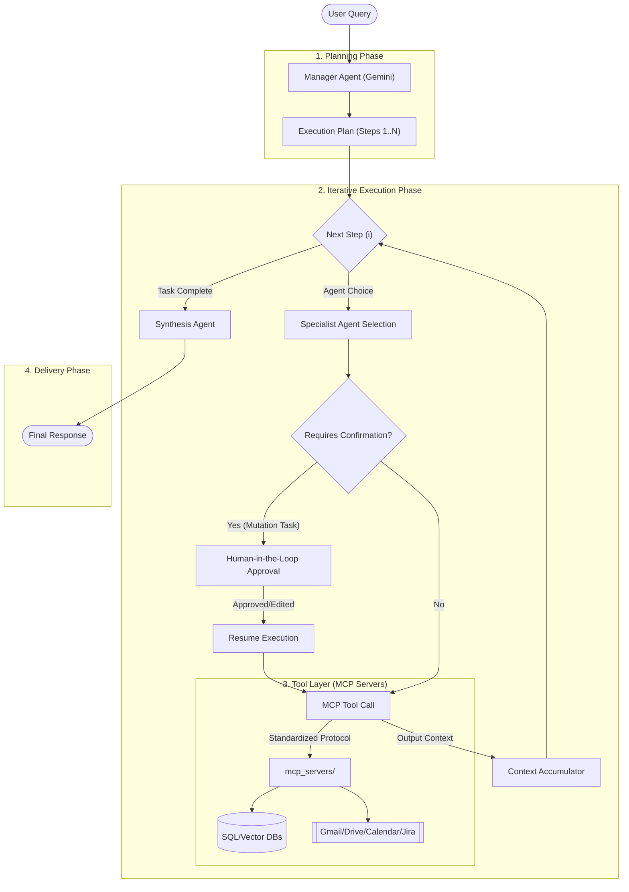

# 🤖 Vertical AI Agent

[](https://www.python.org/)
[](https://fastapi.tiangolo.com/)
[](https://logfire.pydantic.dev/docs/pydantic-ai/)
[](https://modelcontextprotocol.io/)

**A Powerful Multi-Agent Orchestration System built with Pydantic AI and Model Context Protocol (MCP)**

Broad-scoped AI systems often struggle with specialized tasks. **Vertical AI Agent** solves this by using a **Manager-Specialist architecture**. It breaks down complex user requests into discrete, executable steps performed by specialized agents with direct access to corporate tools and data.

> [!IMPORTANT]
> This system is designed for enterprise-grade automation. It handles planning, execution, and synthesis across disparate data silos (SQL, Drive, Meetings) in a single unified flow.

---

## 🏗️ Architecture Overview

The system follows a triple-stage execution model: **Planning** → **Execution** → **Synthesis**.



---

## 🌟 Key Features

### 1. Intelligent Orchestration (The Manager)
The **Manager Agent** (powered by Gemini) acts as the system's brain. It analyzes user intent, considers temporal context (today's date, time), and generates a structured `ExecutionPlan`.
- **Intent Rewriting**: Converts vague user queries into precise, actionable steps.
- **Dependency Resolution**: Steps can depend on outputs from previous steps (e.g., "Use the email address found in Step 1").
- **Input Templating**: Use `{{steps.s1.output}}` to pass data dynamically between agents.
- **Clarification Loop**: If a request is ambiguous, the manager pauses to ask clarifying questions before proceeding.

### 2. Specialized Agent Fleet
Each agent is a domain expert with specific tools (via MCP):
- **📧 Email Agent**: Search, read, and send emails via Gmail.
- **📅 Calendar Agent**: Manage schedules, check availability, and create Google Meet links.
- **🗄️ SQL Expert**: Expert in business schemas (Salesforce/Lead data). Generates and executes safe, read-only MySQL queries.
- **📄 Drive Agent**: Manage files and read document contents across Google Drive.
- **🎙️ TLDV (Meeting RAG)**: Semantic search across past meeting transcripts using Pinecone and vector embeddings.
- **🐞 Jira Agent**: Project management automation for **Jira Data Center** and **Jira Cloud**. Search issues, create tasks/bugs, update statuses, and add comments using Personal Access Tokens (PAT).

### 3. 🛡️ Human-in-the-Loop Safety
Safety is paramount in agentic systems. The executor implements a robust **Confirmation Layer**:
- **High-Risk Actions**: Steps involving data mutation (sending emails, updating databases, deleting files) are flagged.
- **User Approval**: The system pauses execution and requests explicit user confirmation before proceeding with these steps.
- **Modifiability**: Users can edit the agent's proposed action (e.g., rewriting an email draft) before approving it.

### 4. Transparent Execution
- **Streaming Status**: Real-time feedback on what the agents are doing ("Step 1: SQL Agent working...").
- **Deterministic Passing**: Explicit data passing between steps ensures accuracy and prevents "hallucinated actions".

---

## � Common Application Use Cases

### 🏢 Enterprise CRM Automation
**"Find all high-value leads from last month and draft a follow-up email."**
1.  **SQL Agent**: Queries Salesforce DB for leads with `Amount > $10k` created in the last 30 days.
2.  **Manager**: Formats the list of leads.
3.  **Email Agent**: Drafts a personalized outreach email for each lead (pauses for user review).

### 📅 Intelligent Scheduling
**"Schedule a sync with the engineering team to discuss the Q3 roadmap based on the last meeting's notes."**
1.  **TLDV Agent**: Searches past meeting transcripts for "Q3 roadmap" action items.
2.  **Calendar Agent**: Checks availability for all participants mentioned in the notes.
3.  **Calendar Agent**: Creates a Google Meet event with the agenda derived from the transcript.

### 🐞 Automated Bug Triage
**"Check the latest error logs in Drive and create Jira tickets for critical issues."**
1.  **Drive Agent**: Reads the latest log file from the "Server Logs" folder.
2.  **Manager**: Parses the logs to identify "CRITICAL" error lines.
3.  **Jira Agent**: Creates a new bug ticket in the 'ENG' project for each critical error, attaching the log snippet.

---

## �🛠️ Technical Stack

- **Framework**: [Pydantic AI](https://logfire.pydantic.dev/docs/pydantic-ai/) - For structured, type-safe agent interactions.
- **Protocol**: [Model Context Protocol (MCP)](https://modelcontextprotocol.io/) - Standardized communication with external tools.
- **Language Models**: Google Gemini (1.5 Flash / 1.5 Pro).
- **Backend**: FastAPI with Server-Sent Events (SSE) for streaming.
- **Vector DB**: Pinecone (for meeting context retrieval).
- **Database**: MySQL (for business data).
- **Observability**: [Langfuse](https://langfuse.com/) - For tracing agent steps, monitoring latency, and debugging LLM calls.

## 📊 Evaluation Framework
The project includes a robust evaluation pipeline using **RAGAS** (Retrieval Augmented Generation Assessment) to benchmark agent performance:
- **Synthetic Testset Generation**: Automatically generates complex test cases based on seed documents (`evaluation/generate_testset.py`).
- **Metrics**: Measures **Faithfulness**, **Answer Relevancy**, **Context Precision**, and **Context Recall**.
- **Reporting**: Outputs detailed CSV reports to track improvements in agent accuracy over time (`evaluation/evaluate_rag.py`).

---

## 🚀 Getting Started

### Prerequisites
- Python 3.10+
- MySQL Server
- Pinecone Account
- Google Cloud Project (for Workspace APIs)

### Installation

1. **Clone the repository**:
   ```bash
   git clone https://github.com/chetanreddyv/vertical_aiAgent.git
   cd vertical_aiAgent
   ```

2. **Set up virtual environment**:
   ```bash
   python3 -m venv .venv
   source .venv/bin/activate
   pip install -r requirements.txt
   ```

3. **Configure Environment**:
   Create a `.env` file with the following:
   ```env
   GEMINI_API_KEY=your_key
   DB_HOST=localhost
   DB_USER=root
   DB_PASSWORD=your_password
   PINECONE_API_KEY=your_key
   PINECONE_INDEX_NAME=drive-rag
   GOOGLE_OAUTH_CLIENT_ID=...
   GOOGLE_OAUTH_CLIENT_SECRET=...
   JIRA_URL=https://your-jira-domain.com
   JIRA_PAT=your_personal_access_token
   ```

4. **Initialize MCP Servers**:
   The system automatically manages MCP servers defined in `mcp_servers/`. Ensure your credentials for Google and MySQL are correctly configured in the `.env`.

5. **Run the Application**:
   ```bash
   uvicorn main:app --host 0.0.0.0 --port 8000
   ```

---

## 📂 Project Structure

- `main.py`: FastAPI entry point and streaming logic.
- `agents.py`: System prompts and Pydantic AI agent definitions.
- `executor.py`: The "Brain" of the execution phase; manages state and multi-step logic.
- `mcp_servers/`: Standalone MCP servers for SQL, Email, Drive, Calendar, and RAG.
- `utils.py`: Schema formatting, temporal context, and result parsing helpers.

---

## 🤝 Contributing

Contributions are welcome! Please feel free to submit a Pull Request.

---

## 📄 License

MIT License - See the [LICENSE](LICENSE) file for details.
